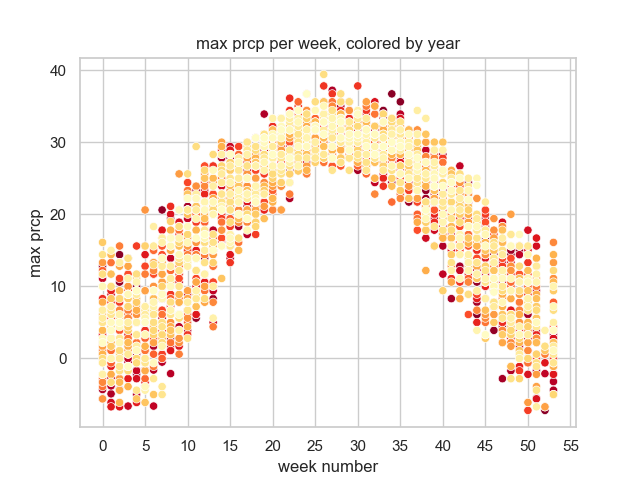

# Python Program to read weather data and create sample plots

## Requirements

To use requires a later version of Python 3 (tested with version 3.8 & 3.9) installed, that has support libraries to use MatPlotLib.  Most full distributions of Linux, or Windows will work once Python is installed.   The Azure Data Science VM has python installed on it. 

Could also use the Docker containers provided by Juypter stacks (see the serverless session in the MSU cloud fellowship for more info and details on these)

One Python is installed, and even for the Data Science VM, you must install other packages listed in the file `requirements.txt` using pip.   You can use this command which is typical for python programs

```
cd Python
pip install -r requirements.txt
```

## Getting the script

You can copy/paste this program into your machine, or use git in the terminal if it's installed

```bash
git clone https://github.com/msucloudfellowship/msu_ccf_miniproject.git
cd msu_ccf_miniproject/Python
```

## Input data 

see the [project readme](../readme.md#data).  


## Running


1. get data
    1. copy the data file `hourly_weather.csv` to this folder, OR
    1. make the data accessible to the computer on some other path, which requires specifying the path when run

2. run the script.  There are several ways to run the python program can be run as follows: 
 
    1. command line:  `Python weather_summary.py`  assumes there is a file `hourly_weather.csv`  in this folder
    1. Windows command line, specificy data file:  `Python weather_summary.py z:\path\to\datafile.csv`
    1. Mac/Linux command line, specificy data file:  `Python weather_summary.py /path/to/datafile.csv`
    1. If you are more comfortable running in a notebook,  in a programming editor or interactive shell, use code like following in this Python directory:

```python
# optional, specify location of weather file if it's not in this folder
weather_file = "hourly_weather.csv" # or something like weather_file = "z:\hourly_weather.csv"  

from weather_summary import *
main(weather_file)
```

## Output 

The script will write 3 png-format files of plots.  An example PNG file is in this folder: 



