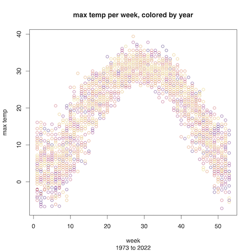

# R script to read weather data and create sample plots

## Requirements

To use requires a later version of R (tested with version 4.1) installed, that has support libraries to use PDF output.  Most full distributions of Linux, or Windows will work once Python is installed.   The Azure Data Science VM (DSVM) has R installed that works. 

Could also use the Docker containers provided by Rocker (see the serverless session in the MSU cloud fellowship for more info and details on these)

The program only uses base R so no other packages need to be installed.  

## Getting the script

You can copy paste the [weather_summary.R](weather_summary.R) script from here into your machine, or use git and clone the whole repository

```bash
git clone https://github.com/msucloudfellowship/msu_ccf_miniproject.git
cd msu_ccf_miniproject/R
```

## Input data 

see the [project readme](../readme.md#data).  

## Running

1. get data
    1. copy the data file `hourly_weather.csv` to this folder, OR
    1. make the data accessible to the computer on some other path, which requires specifying the path when run.  if you want to run on the command line YOu'll then have to set an Environment variable
2. run the script.  There are several ways to run the R program can be run as follows: 
 

    1. Directly in the the R command line, R GUI, or Rstudio interactive environment: use code like following in this R directory:

```R
# optional, specify location of weather file if it's not in this folder
weather_file <- "hourly_weather.csv" # or something like weather_file <- "z:\hourly_weather.csv"  
source("weather_summary.R")
main(weather_file)

```

    3. Running in a terminal.  Typically the `Rscript` command is used to run R programs in a terminal.   This method is helpful to automate the process or in a terminal, but `Rscript` must be in the path.  If it is, then can simply run the following in this R directory

```
# optional: cd R if necessary
Rscript weather_summary.R  path\to\hourly_weather.csv 
# note: put the correct full path to the weather file above, e.g. Z:\ or /mnt/...
```

In the Windows DSVM the `Rscript` command was not on the path, so I had to find the R folder in the `C:\Program Files\R\<Rversion>\bin\Rscript`  which depends on the version of R that is currently installed. 
I don't know if it's on the path for the Linux DSVM from Azure.  


## Output 

The script will write a 3-page PDF with 3 plots (using the R `pdf()` facility). An example version of one pages looks like this: 


